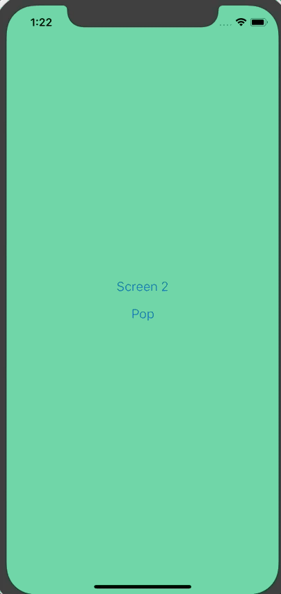

# Intro to Gestures in React Native

In this tutorial we'll be learning to add gesture handling to a React Native app via `PanResponder`. In a [previous tutorial](TODO) I walked through building a basic JavaScript based navigator for React Native which will serve as the basis of this tutorial.

## Getting Started

We'll be using `create-react-native-app` to build our app. To get started run the following from your terminal:

```
create-react-native-app rn-js-navigator
cd rn-js-navigator
```

Replace `App.js` with

```javascript
import React from 'react';
import { StyleSheet, View, Button } from 'react-native';
import { Navigator, Route } from './Navigator';

const Screen1 = ({ navigator }) => (
  <View style={[styles.screen, { backgroundColor: '#59C9A5' }]}>
    <Button
      title="Screen 2"
      onPress={() => navigator.push('Screen2')}
    />
    <Button
      title="Pop"
      onPress={() => navigator.pop()}
    />
  </View>
);

const Screen2 = ({ navigator }) => (
  <View style={[styles.screen, { backgroundColor: '#23395B' }]}>
    <Button
      title="Screen 3"
      onPress={() => navigator.push('Screen3')}
    />
    <Button
      title="Pop"
      onPress={() => navigator.pop()}
    />
  </View>
);

const Screen3 = ({ navigator }) => (
  <View style={[styles.screen, { backgroundColor: '#B9E3C6' }]}>
    <Button
      title="Pop"
      onPress={() => navigator.pop()}
    />
  </View>
);

export default class App extends React.Component {
  render() {
    return (
      <Navigator>
        <Route name="Screen1" component={Screen1} />
        <Route name="Screen2" component={Screen2} />
        <Route name="Screen3" component={Screen3} />
      </Navigator>
    );
  }
}

const styles = StyleSheet.create({
  screen: {
    flex: 1,
    alignItems: 'center',
    justifyContent: 'center',
  },
});
```

and then create a new file, `Navigator.js`, with the following contents

```javascript
import React from 'react';
import { View, StyleSheet, Animated, Dimensions } from 'react-native';

const { width } = Dimensions.get('window');

export const Route = () => null;

const buildSceneConfig = (children = []) => {
  const config = {};

  children.forEach(child => {
    config[child.props.name] = { key: child.props.name, component: child.props.component };
  });

  return config;
};

export class Navigator extends React.Component {
  constructor(props) {
    super(props);

    const sceneConfig = buildSceneConfig(props.children);
    const initialSceneName = props.children[0].props.name;

    this.state = {
      sceneConfig,
      stack: [sceneConfig[initialSceneName]],
    };
  }

  _animatedValue = new Animated.Value(0);

  handlePush = (sceneName) => {
    this.setState(state => ({
      ...state,
      stack: [...state.stack, state.sceneConfig[sceneName]],
    }), () => {
      this._animatedValue.setValue(width);
      Animated.timing(this._animatedValue, {
        toValue: 0,
        duration: 250,
        useNativeDriver: true,
      }).start();
    });
  }

  handlePop = () => {
    Animated.timing(this._animatedValue, {
      toValue: width,
      duration: 250,
      useNativeDriver: true,
    }).start(() => {
      this._animatedValue.setValue(0);
      this.setState(state => {
        const { stack } = state;
        if (stack.length > 1) {
          return {
            stack: stack.slice(0, stack.length - 1),
          };
        }

        return state;
      });
    });
  }

  render() {
    return (
      <View style={styles.container}>
        {this.state.stack.map((scene, index) => {
          const CurrentScene = scene.component;
          const sceneStyles = [styles.scene];

          if (index === this.state.stack.length - 1 && index > 0) {
            sceneStyles.push({
              transform: [
                {
                  translateX: this._animatedValue,
                }
              ]
            });
          }

          return (
            <Animated.View key={scene.key} style={sceneStyles}>
              <CurrentScene
                navigator={{ push: this.handlePush, pop: this.handlePop }}
              />
            </Animated.View>
          );
        })}
      </View>
    )
  }
}

const styles = StyleSheet.create({
  container: {
    flex: 1,
    flexDirection: 'row',
  },
  scene: {
    ...StyleSheet.absoluteFillObject,
    flex: 1,
  },
});
```

We can now setup the gestures. The only gesture we're going to have is, when you've got multiple screens in the stack, you can swipe back to the previous one.

## PanResponder Setup

First we need to import `PanResponder` from React Native.

We'll then go ahead and initialize a new pan responder on our component.

`Navigator.js`
```javascript
export class Navigator extends React.Component {
  // ...

  _panResponder = PanResponder.create({
    onMoveShouldSetPanResponder: (evt, gestureState) => {

    },
    onPanResponderMove: (evt, gestureState) => {

    },
    onPanResponderTerminationRequest: (evt, gestureState) => true,
    onPanResponderRelease: (evt, gestureState) => {

    },
    onPanResponderTerminate: (evt, gestureState) => {

    },
  });

  // ...
}
```

Let's walk through what each of these functions does before we start defining them.

- `onMoveShouldSetPanResponder`: This determines whether our pan responder should actuallly do anything. For this example we want the pan responder to be enabled on all but the first screen and only when the gesture started in the left most 25% of the screen.
- `onPanResponderMove`: When the pan responder is enabled and the move is detected, what should happen? This one gets called a lot.
- `onPanResponderTerminationRequest`: If something else wants to take over gestures, should it be allowed to?
- `onPanResponderRelease`: When the gesture is released/completed, what should happen? For us, if the gesture took up more than 50% of the screen we'll complete it, otherwise we'll keep the user on the current screen.
- `onPanResponderTerminate`: When the gesture is terminated (meaning another component became the responder) what should we do? We'll reset to the current screen.

Finally, we need to actually apply the pan handlers to our container component.

`Navigator.js`
```javascript
export class Navigator extends React.Component {
  // ...

  render() {
    return (
      <View style={styles.container} {...this._panResponder.panHandlers}>
        {this.state.stack.map((scene, index) => {
          // ...
        })}
      </View>
    )
  }
}
```

Now to start the implementation.

```javascript
onMoveShouldSetPanResponder: (evt, gestureState) => {
  const isFirstScreen = this.state.stack.length === 1
  const isFarLeft = evt.nativeEvent.pageX < Math.floor(width * 0.25);

  if (!isFirstScreen && isFarLeft) {
    return true;
  }
  return false;
},
```

First we check if we're on the first screen by analyzing `this.state.stack`, which represents the currently active screens. We then check where the gesture first started by looking at `evt.nativeEvent.pageX` and see if it's within the left most 25% of the screen.

We then check whether or not we should actually start responding to the gesture! We should only respond if we're on screen 2+ and if the gesture started in the left quarter of the screen.

```javascript
onPanResponderMove: (evt, gestureState) => {
  this._animatedValue.setValue(gestureState.moveX);
},
```

Now, once the pan responder has been enabled we'll update `this._animatedValue`, which drives our offset, to be whatever the value that is provided. `gestureState.moveX` is going to be wherever the user's finger is on the x axis.

You can actually go ahead and test it now. It's working but when you let go/stop the gesture the screen just sticks there.

```javascript
onPanResponderRelease: (evt, gestureState) => {
  if (Math.floor(gestureState.moveX) >= width / 2) {
    this.handlePop();
  } else {
    Animated.timing(this._animatedValue, {
      toValue: 0,
      duration: 250,
      useNativeDriver: true,
    }).start();
  }
},
```

To fix that we need to implement `onPanResponderRelease`. In this function we're going to check if wherever the user released the screen was in the right 50% of the screen. If it was then we'll call the `this.handlePop` function to finish the animation and pop the screen off the stack.

If the screen wasn't in the right most 50% then we'll reset the screen offset to 0.

```javascript
onPanResponderTerminate: (evt, gestureState) => {
  Animated.timing(this._animatedValue, {
    toValue: 0,
    duration: 250,
    useNativeDriver: true,
  }).start();
},
```

And when the pan responder is taken over we'll reset the screen to a 0 offset.

All of this leaves us with the following



The final `Navigator.js` is

```javascript
import React from 'react';
import { View, StyleSheet, Animated, Dimensions, PanResponder } from 'react-native';

const { width } = Dimensions.get('window');

export const Route = () => null;

const buildSceneConfig = (children = []) => {
  const config = {};

  children.forEach(child => {
    config[child.props.name] = { key: child.props.name, component: child.props.component };
  });

  return config;
};

export class Navigator extends React.Component {
  constructor(props) {
    super(props);

    const sceneConfig = buildSceneConfig(props.children);
    const initialSceneName = props.children[0].props.name;

    this.state = {
      sceneConfig,
      stack: [sceneConfig[initialSceneName]],
    };
  }

  _animatedValue = new Animated.Value(0);

  _panResponder = PanResponder.create({
    onMoveShouldSetPanResponder: (evt, gestureState) => {
      const isFirstScreen = this.state.stack.length === 1
      const isFarLeft = evt.nativeEvent.pageX < Math.floor(width * 0.25);

      if (!isFirstScreen && isFarLeft) {
        return true;
      }
      return false;
    },
    onPanResponderMove: (evt, gestureState) => {
      this._animatedValue.setValue(gestureState.moveX);
    },
    onPanResponderTerminationRequest: (evt, gestureState) => true,
    onPanResponderRelease: (evt, gestureState) => {
      if (Math.floor(gestureState.moveX) >= width / 2) {
        this.handlePop();
      } else {
        Animated.timing(this._animatedValue, {
          toValue: 0,
          duration: 250,
          useNativeDriver: true,
        }).start();
      }
    },
    onPanResponderTerminate: (evt, gestureState) => {
      Animated.timing(this._animatedValue, {
        toValue: 0,
        duration: 250,
        useNativeDriver: true,
      }).start();
    },
  });

  handlePush = (sceneName) => {
    this.setState(state => ({
      ...state,
      stack: [...state.stack, state.sceneConfig[sceneName]],
    }), () => {
      this._animatedValue.setValue(width);
      Animated.timing(this._animatedValue, {
        toValue: 0,
        duration: 250,
        useNativeDriver: true,
      }).start();
    });
  }

  handlePop = () => {
    Animated.timing(this._animatedValue, {
      toValue: width,
      duration: 250,
      useNativeDriver: true,
    }).start(() => {
      this._animatedValue.setValue(0);
      this.setState(state => {
        const { stack } = state;
        if (stack.length > 1) {
          return {
            stack: stack.slice(0, stack.length - 1),
          };
        }

        return state;
      });
    });
  }

  render() {
    return (
      <View style={styles.container} {...this._panResponder.panHandlers}>
        {this.state.stack.map((scene, index) => {
          const CurrentScene = scene.component;
          const sceneStyles = [styles.scene];

          if (index === this.state.stack.length - 1 && index > 0) {
            sceneStyles.push({
              transform: [
                {
                  translateX: this._animatedValue,
                }
              ]
            });
          }

          return (
            <Animated.View key={scene.key} style={sceneStyles}>
              <CurrentScene
                navigator={{ push: this.handlePush, pop: this.handlePop }}
              />
            </Animated.View>
          );
        })}
      </View>
    )
  }
}

const styles = StyleSheet.create({
  container: {
    flex: 1,
    flexDirection: 'row',
  },
  scene: {
    ...StyleSheet.absoluteFillObject,
    flex: 1,
  },
});
```

You can find a running example [on Snack](https://snack.expo.io/@spencercarli/basic-javascript-navigator-example).

---

I hope you found this example fun and valuable! If you're interested in learning more about React Native checkout my [free basics of React Native course](https://learn.handlebarlabs.com/p/react-native-basics-build-a-currency-converter)! Or, if you're further along, checkout my [Production Ready React Native course](https://learn.handlebarlabs.com/p/learn-to-send-react-native-apps-to-production)!
