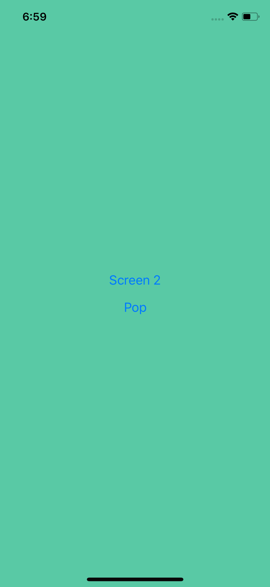
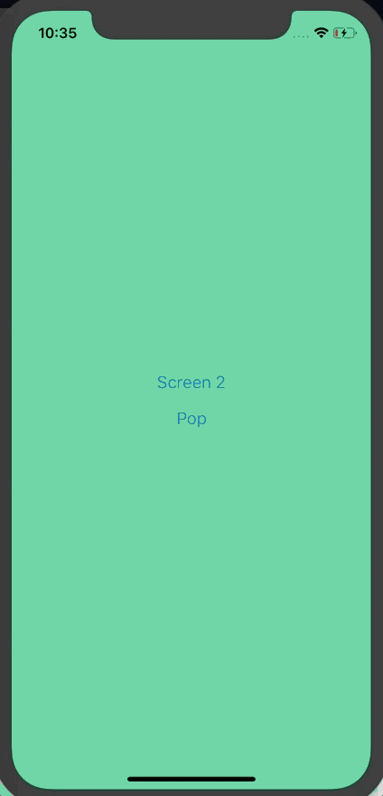
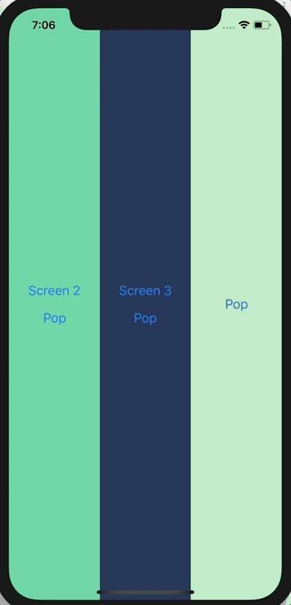
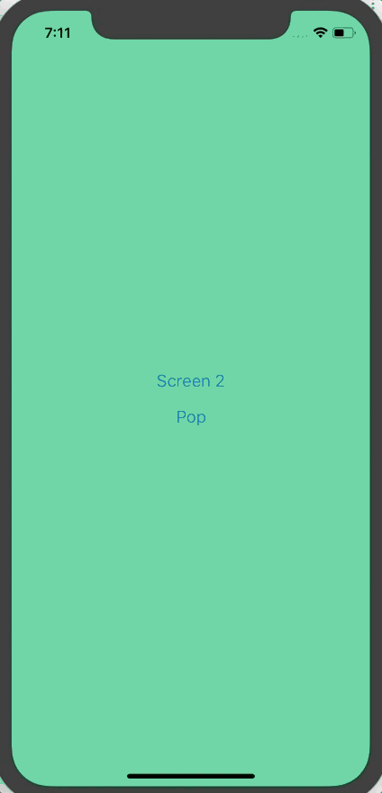
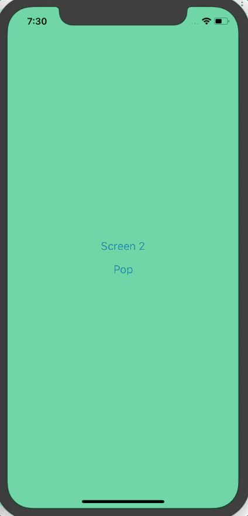
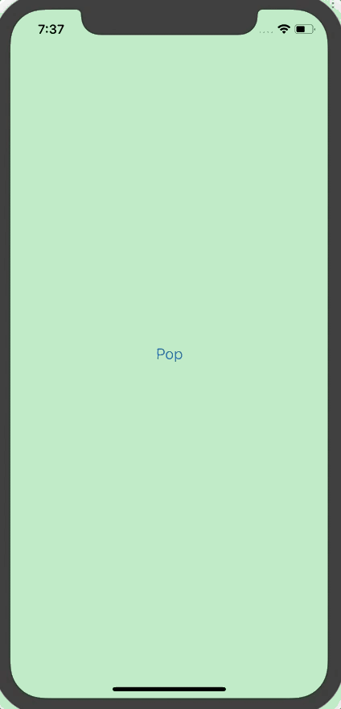

# Build a JavaScript Navigator for React Native

Navigation is a hot, and often contested, topic in React Native. It's something nearly every app has, multiple solutions exists, and they each have their pros and cons.

There are great solutions out there ([React Navigation](https://reactnavigation.org/) and [React Native Navigation](https://wix.github.io/react-native-navigation/) are my top choices for a "real" app) but I think building a navigator is a _great_ exercise. It forces you to design an API, work with animations, handle gestures, and more.

So that's what we'll do today. We'll build a _basic_ JavaScript navigator for React Native.

## Requirements

We're going to build a navigator that allows us to keep a stack of cards. It should

- have a simple declarative API
- allow us to push new screens onto the stack
- pop the current one off the screen and go to the previous
- animate between screen transitions
- handle user gestures for swiping back (covered in part 2)

## Getting Started

I'll be using `create-react-native-app` to create my project. You can run the following in your terminal

```
create-react-native-app rn-js-navigator
```

You can then run the app on an iOS or Android simulator with `yarn run ios` or `yarn run android`, respectively.

## API Design

The navigator will have one `Navigator` component with which we wrap all of the valid screens. Each screen we want to register with the navigator will be passed in a `Route` component.

```javascript
<Navigator>
  <Route name="Screen1" component={Screen1} />
  <Route name="Screen2" component={Screen2} />
  <Route name="Screen3" component={Screen3} />
</Navigator>
```

The top level `Navigator` component is where all the actual work happens. The `Route` component allows us to pass various properties/configuration down for each screen - in this case a name (which will be used to specific which screen should be pushed) and a component (which component should actually be rendered).

Each route will get a `navigator` prop passed to it and on that `navigator` prop a `push` and `pop` function will be on it. Allowing for the following type of interaction:

```javascript
const Screen2 = ({ navigator }) => (
  <View style={[styles.screen, { backgroundColor: '#23395B' }]}>
    <Button
      title="Screen 3"
      onPress={() => navigator.push('Screen3')}
    />
    <Button
      title="Pop"
      onPress={() => navigator.pop()}
    />
  </View>
);
```

Alright, with the basic API outlined, lets get to writing some code.

## Boilerplate

First, let's create the three screens we'll use in our app. In `App.js` replace the file with the following

`App.js`
```javascript
import React from 'react';
import { StyleSheet, View, Button } from 'react-native';

const Screen1 = ({ navigator }) => (
  <View style={[styles.screen, { backgroundColor: '#59C9A5' }]}>
    <Button
      title="Screen 2"
      onPress={() => navigator.push('Screen2')}
    />
    <Button
      title="Pop"
      onPress={() => navigator.pop()}
    />
  </View>
);

const Screen2 = ({ navigator }) => (
  <View style={[styles.screen, { backgroundColor: '#23395B' }]}>
    <Button
      title="Screen 3"
      onPress={() => navigator.push('Screen3')}
    />
    <Button
      title="Pop"
      onPress={() => navigator.pop()}
    />
  </View>
);

const Screen3 = ({ navigator }) => (
  <View style={[styles.screen, { backgroundColor: '#B9E3C6' }]}>
    <Button
      title="Pop"
      onPress={() => navigator.pop()}
    />
  </View>
);

export default Screen1;

const styles = StyleSheet.create({
  screen: {
    flex: 1,
    alignItems: 'center',
    justifyContent: 'center',
  },
});
```



Now, let's create a `Navigator.js` file in which all of our navigation logic will live. Right now it's just going to be a skeleton of the exported components.

`Navigator.js`
```javascript
import React from 'react';

export const Route = () => null;

export class Navigator extends React.Component {
  render() {
    return null;
  }
}
```

Now, lets go back to `App.js` and use these new components to define our routes.

First we need to import our components.

`App.js`
```javascript
import { Navigator, Route } from './Navigator';
```

The replace

```javascript
export default Screen1;
```

with

`App.js`
```javascript
export default class App extends React.Component {
  render() {
    return (
      <Navigator>
        <Route name="Screen1" component={Screen1} />
        <Route name="Screen2" component={Screen2} />
        <Route name="Screen3" component={Screen3} />
      </Navigator>
    );
  }
}
```

If you see a blank white screen you're exactly where you should be!


## Rendering Screens

All of our screens are accessible via `this.props.children` in the Navigator component. You could render the first screen via

`Navigator.js`
```javascript
export class Navigator extends React.Component {
  render() {
    const CurrentScene = this.props.children[0].props.component;
    return <CurrentScene />;
  }
}
```

which should now show the green `Screen1` again. This works, but accessing everything via `this.props.children` won't work very well going forward. We're going to need some internal state.

First, we'll store a `stack` array which will track the current stack of rendered screens. It should default to the first child of `Navigator`. We're also going to create an easier to use `sceneConfig` object that will allow us to access all of the data we need quickly when pushing a new screen onto the stack.

First we'll create a `buildSceneConfig` function that accepts the `Navigator` children as an argument.

`Navigator.js`
```javascript
const buildSceneConfig = (children = []) => {
  const config = {};

  children.forEach(child => {
    config[child.props.name] = { key: child.props.name, component: child.props.component };
  });

  return config;
};
```

Inside of this function we'll populate an object that represents our `sceneConfig`. This results in the following data.

```javascript
{
  Scene1: {
    key: 'Scene1',
    component: Scene1,
  },
  Scene2: {
    key: 'Scene2',
    component: Scene2,
  },
  Scene2: {
    key: 'Scene2',
    component: Scene2,
  },
}
```

We can then use this function in the `constructor` of the `Navigator` component and store the result in state. We can also populate our `stack` with the first screen.

`Navigator.js`
```javascript
export class Navigator extends React.Component {
  constructor(props) {
    super(props);

    const sceneConfig = buildSceneConfig(props.children);
    const initialSceneName = props.children[0].props.name;

    this.state = {
      sceneConfig,
      stack: [sceneConfig[initialSceneName]],
    };
  }

  // ...
}
```

We can then use `this.state.stack` to render our screen.

`Navigator.js`
```javascript
export class Navigator extends React.Component {
  constructor(props) {
    super(props);

    const sceneConfig = buildSceneConfig(props.children);
    const initialSceneName = props.children[0].props.name;

    this.state = {
      sceneConfig,
      stack: [sceneConfig[initialSceneName]],
    };
  }

  render() {
    const CurrentScene = this.state.stack[0].component;
    return <CurrentScene />;
  }
}
```

## Push Action

If you were to press "Screen 2" at this point the app will error with `Cannot read property 'push' of undefined`.

That's because we aren't yet passing a `navigator` prop down to the scene. In this navigator prop we'll pass the push action. Let's write that push handler now.

`Navigator.js`
```javascript
export class Navigator extends React.Component {
  constructor(props) { ... }

  handlePush = (sceneName) => {
    this.setState(state => ({
      ...state,
      stack: [...state.stack, state.sceneConfig[sceneName]],
    }));
  }

  render() { ... }
}
```

All we're doing here is accepting a `sceneName`, which should correspond to a `name` prop given to one of our `Route` components and then finding the corresponding scene config for that route and adding it to the stack.

We can then need to make the `push` function available to the current scene.

`Navigator.js`
```javascript
export class Navigator extends React.Component {
  constructor(props) { ... }

  handlePush = (sceneName) => {
    this.setState(state => ({
      ...state,
      stack: [...state.stack, state.sceneConfig[sceneName]],
    }));
  }

  render() {
    const CurrentScene = this.state.stack[0].component;
    return <CurrentScene navigator={{ push: this.handlePush }} />;
  }
}
```

If you press "Screen 2" now now error occurs! But also nothing is displayed. Let's fix that.

To do so we'll need to loop over `this.state.stack` and render the screens (we'll take care of styling later).

First you'll need to import some components from React Native.

`Navigator.js`
```javascript
import { View, StyleSheet } from 'react-native';
```

We'll then loop over `this.state.stack` and render each scene. We'll also set up some styling for the container view.

`Navigator.js`
```javascript
export class Navigator extends React.Component {
  // ...

  render() {
    return (
      <View style={styles.container}>
        {this.state.stack.map((scene, index) => {
          const CurrentScene = scene.component;
          return (
            <CurrentScene
              key={scene.key}
              navigator={{ push: this.handlePush }}
            />
          );
        })}
      </View>
    )
  }
}

const styles = StyleSheet.create({
  container: {
    flex: 1,
    flexDirection: 'row',
  },
});
```

When you press a screen name you should now see something like this.



## Pop Action

Before we fix the styling, let's add a pop action.

`Navigator.js`
```javascript
export class Navigator extends React.Component {
  // ...

  handlePop = () => {
    this.setState(state => {
      const { stack } = state;
      if (stack.length > 1) {
        return {
          stack: stack.slice(0, stack.length - 1),
        };
      }

      return state;
    });
  }

  render() {
    return (
      <View style={styles.container}>
        {this.state.stack.map((scene, index) => {
          const CurrentScene = scene.component;
          return (
            <CurrentScene,
              key={scene.key}
              navigator={{ push: this.handlePush, pop: this.handlePop }}
            />
          );
        })}
      </View>
    )
  }
}
```

In the `handlePop` function we're checking if the stack has more than one screen and if so, we remove the last screen in that stack.

Make sure you pass the `pop` function down on the `navigator` prop!



## Styling

To ensure screens show up on top of each other we'll use absolute positioning. `StyleSheet.absoluteFillObject` is a nice short hand option for this.

`Navigator.js`
```javascript
export class Navigator extends React.Component {
  // ...

  render() {
    return (
      <View style={styles.container}>
        {this.state.stack.map((scene, index) => {
          const CurrentScene = scene.component;
          return (
            <View key={scene.key} style={styles.scene}>
              <CurrentScene
                navigator={{ push: this.handlePush, pop: this.handlePop }}
              />
            </View>
          );
        })}
      </View>
    )
  }
}

const styles = StyleSheet.create({
  // ...
  scene: {
    ...StyleSheet.absoluteFillObject,
    flex: 1,
  },
});
```

Notice that we're wrapping `CurrentScreen` component in a `View` component to apply the styles. We also need a `flex: 1` so the view takes up the entire screen. Notice also that the `key` moved from `CurrentScene` to the `View`.



## Animation

Alright, final thing for this tutorial. The animation! We're going to do a right-to-left animation, as is typical on iOS.

First let's take care of a few modules we need to import.

`Navigator.js`
```javascript
import { View, StyleSheet, Animated, Dimensions } from 'react-native';

const { width } = Dimensions.get('window');
```

We need `Animated` to manage animations efficiently and `Dimensions` so we can get the width of the screen.

We'll then intialize a new `_animatedValue` on the component to drive the swipe animation.

`Navigator.js`
```javascript
export class Navigator extends React.Component {
  // ...

  _animatedValue = new Animated.Value(0);

  // ...
}
```

Now that the boilerplate is setup, let's add the right-to-left animation when you push a new screen onto the stack.

It's important to do this at the right time. The right time in this case is  _after_ we've updated the state. That means we'll start the animation in the `setState` callback.

`Navigator.js`
```javascript
export class Navigator extends React.Component {
  // ...

  handlePush = (sceneName) => {
    this.setState(state => ({
      ...state,
      stack: [...state.stack, state.sceneConfig[sceneName]],
    }), () => {
      this._animatedValue.setValue(width);
      Animated.timing(this._animatedValue, {
        toValue: 0,
        duration: 250,
        useNativeDriver: true,
      }).start();
    });
  }

  // ...
}
```

First we set the `_animatedValue` to the width of the screen. That's what the starting offset will be. If you wanted it offset to the left then it would be -width.

Once we set that value we actually do the animation. This animation brings the offset to 0 or fully visible on the screen. The `duration` I set is an arbitrary value.

Finally, notice that I'm use `useNativeDriver`. This is an important thing to do when working with Animations in React Native as it will provide better performance of your animations and reduce the likelihood of "jitter" in your animations.

Now that we're setting the values correctly we need to apply them, which will happen in the `render` function.

`Navigator.js`
```javascript
export class Navigator extends React.Component {
  // ...

  render() {
    return (
      <View style={styles.container}>
        {this.state.stack.map((scene, index) => {
          const CurrentScene = scene.component;
          // Create an array of styles for the scene
          const sceneStyles = [styles.scene];

          // If we're on the last screen and there's more than one screen in the stack then animation makes sense.
          if (index === this.state.stack.length - 1 && index > 0) {
            sceneStyles.push({
              transform: [
                {
                  translateX: this._animatedValue,
                }
              ]
            });
          }

          // Convert the View to Animated.View
          return (
            <Animated.View key={scene.key} style={sceneStyles}>
              <CurrentScene
                navigator={{ push: this.handlePush, pop: this.handlePop }}
              />
            </Animated.View>
          );
        })}
      </View>
    )
  }
}
```

Okay, there's a bit going on here. First off we're setting up a `sceneStyles` array for the containing scene view as the styles can be different between screens.

We then determine whether a screen should be animated. An animation only makes sense when there is more than 1 screen in the stack. We also want to apply the styles to the active/last screen.

We then use a `transform` style, where we target the `translateX` value, to apply the `this._animatedValue` value. When you use `useNativeDriver` you're limited on which values you can modify - transform props are one of them!

Finally, we moved from `View` to `Animated.View` and passed the `sceneStyles` to the `style` prop.

That leaves us with the following.



Woo! Progress. Now the `pop` action.

This time we want to run our animation _before_ we update state because we only want to remove the screen from state _after_ it's off screen. Make sense?

`Navigator.js`
```javascript
export class Navigator extends React.Component {
  // ...

  handlePop = () => {
    Animated.timing(this._animatedValue, {
      toValue: width,
      duration: 250,
      useNativeDriver: true,
    }).start(() => {
      this._animatedValue.setValue(0);
      this.setState(state => {
        const { stack } = state;
        if (stack.length > 1) {
          return {
            stack: stack.slice(0, stack.length - 1),
          };
        }

        return state;
      });
    });
  }

  // ...
}
```

First we'll make our offset go to the screen width. Once the animation is complete (which we know by the callback in the `.start` function being called) we need to make sure to reset our offset to 0 so that the new active screen is fully visible.



## Final Code

The final code for Navigator.js:

`Navigator.js`
```javascript
import React from 'react';
import { View, StyleSheet, Animated, Dimensions } from 'react-native';

const { width } = Dimensions.get('window');

export const Route = () => null;

const buildSceneConfig = (children = []) => {
  const config = {};

  children.forEach(child => {
    config[child.props.name] = { key: child.props.name, component: child.props.component };
  });

  return config;
};

export class Navigator extends React.Component {
  constructor(props) {
    super(props);

    const sceneConfig = buildSceneConfig(props.children);
    const initialSceneName = props.children[0].props.name;

    this.state = {
      sceneConfig,
      stack: [sceneConfig[initialSceneName]],
    };
  }

  _animatedValue = new Animated.Value(0);

  handlePush = (sceneName) => {
    this.setState(state => ({
      ...state,
      stack: [...state.stack, state.sceneConfig[sceneName]],
    }), () => {
      this._animatedValue.setValue(width);
      Animated.timing(this._animatedValue, {
        toValue: 0,
        duration: 250,
        useNativeDriver: true,
      }).start();
    });
  }

  handlePop = () => {
    Animated.timing(this._animatedValue, {
      toValue: width,
      duration: 250,
      useNativeDriver: true,
    }).start(() => {
      this._animatedValue.setValue(0);
      this.setState(state => {
        const { stack } = state;
        if (stack.length > 1) {
          return {
            stack: stack.slice(0, stack.length - 1),
          };
        }

        return state;
      });
    });
  }

  render() {
    return (
      <View style={styles.container}>
        {this.state.stack.map((scene, index) => {
          const CurrentScene = scene.component;
          const sceneStyles = [styles.scene];

          if (index === this.state.stack.length - 1 && index > 0) {
            sceneStyles.push({
              transform: [
                {
                  translateX: this._animatedValue,
                }
              ]
            });
          }

          return (
            <Animated.View key={scene.key} style={sceneStyles}>
              <CurrentScene
                navigator={{ push: this.handlePush, pop: this.handlePop }}
              />
            </Animated.View>
          );
        })}
      </View>
    )
  }
}

const styles = StyleSheet.create({
  container: {
    flex: 1,
    flexDirection: 'row',
  },
  scene: {
    ...StyleSheet.absoluteFillObject,
    flex: 1,
  },
});
```


## Additional Challenges

Looking to further work on this example? Here's a few additional things you can work on implementing to further your experience.

- Add an overlay/shadow on the previous screen to give the appearance that the screen is behind, like iOS does
- Allow the consumer to set an initial screen via an `initialSceneName` prop rather than forcing it to be the first screen registered in the `Navigator` component.
- Set a `backgroundColor` prop to allow the consumer to set the background color for any transparent components.
- Allow the consumer to swap direction of animation for right-to-left languages
- Add a swipe back gesture (interested in learning this? Check out [my blog post on how to do so](TODO)!)

---

Thanks for reading and I hope you found this exercise valuable! Whenever I want to better understanding something, or just want a code challenge, I try to find something I use often and start rebuilding it to scratch. Not only can it help you better understand what's going on but it can also help you contribute back to the open source solution you typically use!

My name is Spencer Carli - I teach people to use React Native to make their product vision a reality through online tutorials and consulting. Looking for more tutorials? Checkout [my courses](https://learn.handlebarlabs.com/), [tutorials](https://medium.com/@spencer_carli), or [Youtube channel](https://www.youtube.com/handlebarlabs)!
